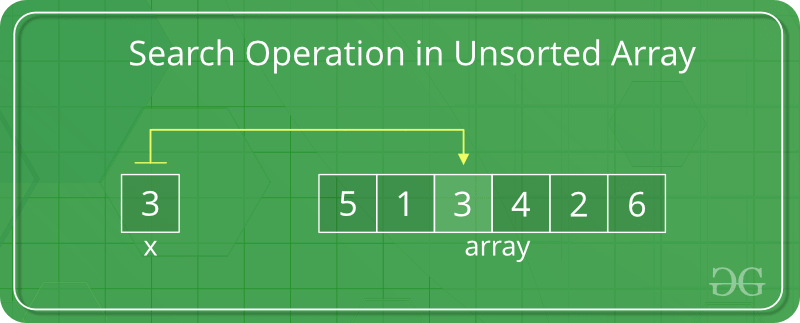
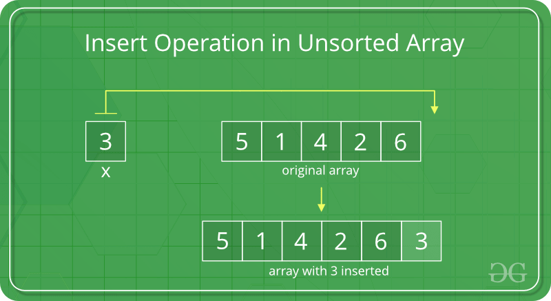
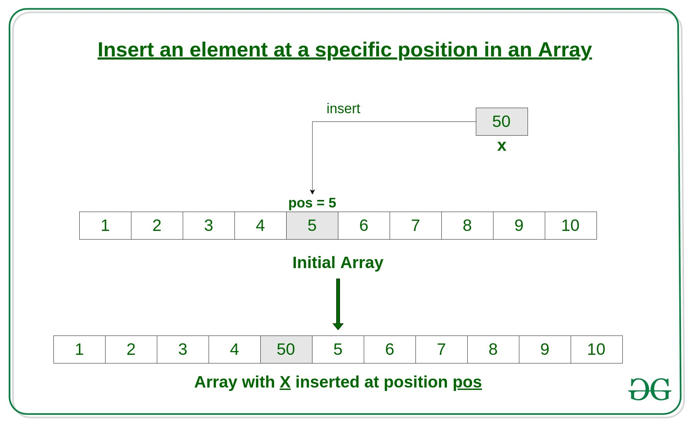
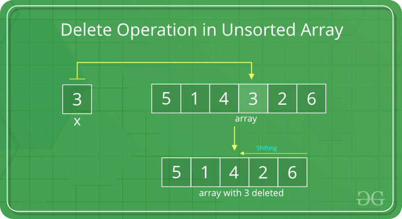

# Array

Un array es una estructura de datos lineal en la que se almacenan varios elementos del mismo tipo en una secuencia consecutiva de memoria. Cada elemento puede ser accedido por un índice numérico y la longitud de un array es fija y se establece en el momento de su creación. Es una forma eficiente de almacenar y acceder a elementos si se conoce el índice de los elementos requeridos.

## Search Operation

<p align="center">
  
</p>

La operación de búsqueda en un array no ordenado consiste en encontrar un elemento específico comparando cada elemento del array mediante un recorrido lineal, con una complejidad temporal de O(n).

```c++
// C++ program to implement linear
// search in unsorted array
#include <bits/stdc++.h>
using namespace std;
 
// Function to implement search operation
int findElement(int arr[], int n, int key)
{
    int i;
    for (i = 0; i < n; i++)
        if (arr[i] == key)
            return i;
     
      // If the key is not found
    return -1;
}
 
// Driver's Code
int main()
{
    int arr[] = { 12, 34, 10, 6, 40 };
    int n = sizeof(arr) / sizeof(arr[0]);
 
    // Using a last element as search element
    int key = 40;
   
      // Function call
    int position = findElement(arr, n, key);
 
    if (position == -1)
        cout << "Element not found";
    else
        cout << "Element Found at Position: "
             << position + 1;
 
    return 0;
}
```

## Insert Operation

1. **Insert at the end**: La operación de inserción en el final de un array es más rápida en comparación con un array ordenado ya que no se debe preocupar por la posición en la que se colocará el elemento. Se agrega simplemente al final del array. La complejidad temporal para esta operación es O(1) y el espacio auxiliar es O(1).

<p align="center">
  
</p>

```c++
// C++ program to implement insert
// operation in an unsorted array.
#include <iostream>
using namespace std;
 
// Inserts a key in arr[] of given capacity.
// n is current size of arr[]. This
// function returns n + 1 if insertion
// is successful, else n.
int insertSorted(int arr[], int n, int key, int capacity)
{
 
    // Cannot insert more elements if n is
    // already more than or equal to capacity
    if (n >= capacity)
        return n;
 
    arr[n] = key;
 
    return (n + 1);
}
 
// Driver Code
int main()
{
    int arr[20] = { 12, 16, 20, 40, 50, 70 };
    int capacity = sizeof(arr) / sizeof(arr[0]);
    int n = 6;
    int i, key = 26;
 
    cout << "\n Before Insertion: ";
    for (i = 0; i < n; i++)
        cout << arr[i] << " ";
 
    // Inserting key
    n = insertSorted(arr, n, key, capacity);
 
    cout << "\n After Insertion: ";
    for (i = 0; i < n; i++)
        cout << arr[i] << " ";
 
    return 0;
}
```

2. **Insert at any position**: Es una operación que permite insertar un elemento en cualquier posición en un array, requiere desplazar los elementos a la derecha que están en la posición requerida para hacer espacio para el nuevo elemento.

<p align="center">
  
</p>

```c++
#include <bits/stdc++.h>
using namespace std;
 
// Función para insertar un elemento
// en una posición específica
void insertElement(int arr[], int n, int x, int pos)
{
    // desplazar los elementos hacia la derecha
    // que están a la derecha de pos
    for (int i = n - 1; i >= pos; i--)
        arr[i + 1] = arr[i];
 
    arr[pos] = x;
}
 
// Código del conductor
int main()
{
    int arr[15] = { 2, 4, 1, 8, 5 };
    int n = 5;
 
    cout<<"Antes de la inserción: ";
    for (int i = 0; i < n; i++)
        cout<<arr[i]<<" ";
 
    cout<<endl;
 
    int x = 10, pos = 2;
   
      // Llamada a la función
    insertElement(arr, n, x, pos);
    n++;
 
    cout<<"Después de la inserción: ";
    for (int i = 0; i < n; i++)
        cout<<arr[i]<<" ";
 
    return 0;
}
```

## Delete Operation

La operación de eliminación en un array consiste en buscar el elemento a eliminar mediante una búsqueda lineal, y luego realizar la operación de eliminación seguida por el desplazamiento de los elementos.

<p align="center">
  

```c++

// C++ program to implement delete operation in a
// unsorted array
#include <iostream>
using namespace std;
 
// To search a key to be deleted
int findElement(int arr[], int n, int key);
 
// Function to delete an element
int deleteElement(int arr[], int n, int key)
{
    // Find position of element to be deleted
    int pos = findElement(arr, n, key);
 
    if (pos == -1) {
        cout << "Element not found";
        return n;
    }
 
    // Deleting element
    int i;
    for (i = pos; i < n - 1; i++)
        arr[i] = arr[i + 1];
 
    return n - 1;
}
 
// Function to implement search operation
int findElement(int arr[], int n, int key)
{
    int i;
    for (i = 0; i < n; i++)
        if (arr[i] == key)
            return i;
 
    return -1;
}
 
// Driver's code
int main()
{
    int i;
    int arr[] = { 10, 50, 30, 40, 20 };
 
    int n = sizeof(arr) / sizeof(arr[0]);
    int key = 30;
 
    cout << "Array before deletion\n";
    for (i = 0; i < n; i++)
        cout << arr[i] << " ";
     
   
      // Function call
    n = deleteElement(arr, n, key);
 
    cout << "\n\nArray after deletion\n";
    for (i = 0; i < n; i++)
        cout << arr[i] << " ";
 
    return 0;
}
```