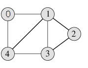

# GRAPH

grafo es una estructura de datos que consta de dos componentes: un conjunto finito de nodos y un conjunto finito de pares ordenados de la forma (u, v) llamados aristas. Las aristas pueden tener peso o valor, y se utilizan para representar conexiones o relaciones entre los nodos.

Los grafos se utilizan para representar muchas aplicaciones de la vida real, como redes de computadoras, redes telefónicas, redes eléctricas y redes sociales como Facebook o LinkedIn. En estos casos, los nodos pueden representar personas, dispositivos, ciudades, etc., y las aristas pueden representar conexiones físicas, conexiones lógicas o relaciones sociales entre ellos.

A continuación se muestra un ejemplo de un grafo no dirigido con 5 nodos.

<p align="center">
  
</p>

**Las dos representaciones de grafo más comúnmente utilizadas:**

1. *Matriz de adyacencia*: es una matriz bidimensional que representa todas las aristas del grafo. Cada fila y cada columna de la matriz representan un nodo del grafo, y el valor en la intersección de la fila i y la columna j indica si existe una arista que conecta el nodo i con el nodo j. En el caso de un grafo no ponderado, el valor es 1 si existe una arista y 0 si no existe. En el caso de un grafo ponderado, el valor puede ser el peso o el costo de la arista.

2. *Lista de adyacencia*: es una lista de enlaces que representa cada nodo y las aristas que lo conectan a otros nodos. Para cada nodo en el grafo, la lista de adyacencia contiene una lista de todos los nodos a los que está conectado, es decir, sus nodos adyacentes. En el caso de un grafo no ponderado, la lista de adyacencia contiene simplemente una lista de los nodos adyacentes. En el caso de un grafo ponderado, la lista de adyacencia contiene una lista de pares ordenados que indican el nodo adyacente y el peso o costo de la arista.

# Matriz de Adyacencia

La representación de Matriz de Adyacencia es una matriz bidimensional de tamaño V x V, donde V es el número de vértices en el grafo. Cada casilla adj[i][j] en la matriz representa una arista desde el vértice i al vértice j, y tiene un valor de 1 si la arista existe, y 0 si no existe.

Para un grafo no dirigido, la matriz de adyacencia siempre es simétrica, por lo que si adj[i][j] es 1, entonces adj[j][i] también es 1. En el ejemplo del grafo no dirigido con 5 vértices, la matriz de adyacencia sería:

```m
   0  1  2  3  4
0  0  1  1  0  0
1  1  0  1  1  0
2  1  1  0  1  1
3  0  1  1  0  1
4  0  0  1  1  0
```

Para un grafo dirigido, la matriz de adyacencia no necesita ser simétrica, ya que puede haber aristas en una sola dirección. En el ejemplo del grafo dirigido con 4 vértices, la matriz de adyacencia sería:

```m
   0  1  2  3
0  0  1  0  0
1  0  0  1  0
2  1  0  0  1
3  1  0  0  0
```

En este caso, adj[0][1] = 1 indica que hay una arista desde el vértice 0 al vértice 1, y adj[2][3] = 1 indica que hay una arista desde el vértice 2 al vértice 3.

**Code**

```c++
#include <iostream>
using namespace std;

int main()
{
    // n es el número de vértices
    // m es el número de aristas
    int n, m;
    // Leer los valores de n y m desde la entrada estándar
    cin >> n >> m;
    // Crear una matriz de adyacencia de tamaño n+1 x n+1
    // La matriz se inicializa con ceros automáticamente
    int adjMat[n + 1][n + 1];
    // Leer las aristas del grafo
    for (int i = 0; i < m; i++) {
        int u, v;
        cin >> u >> v;
        // Marcar que hay una arista entre u y v
        // (y también entre v y u, ya que el grafo es no dirigido)
        adjMat[u][v] = 1;
        adjMat[v][u] = 1;
    }

    // El programa finaliza sin errores
    return 0;
}
```