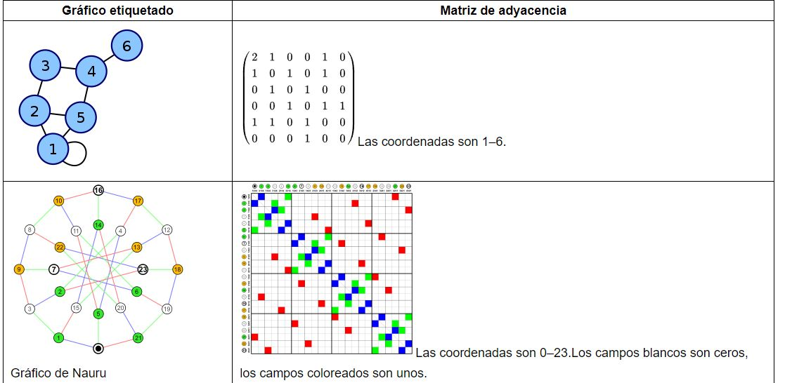
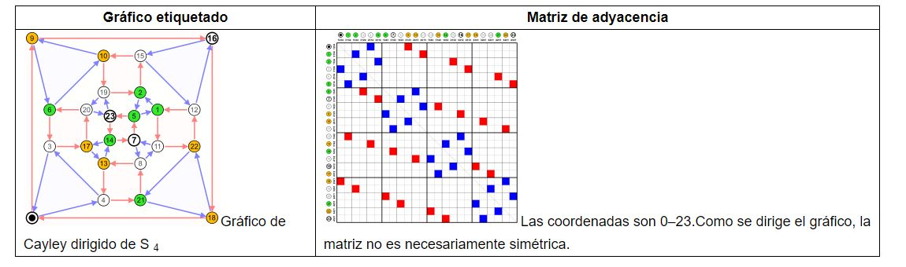
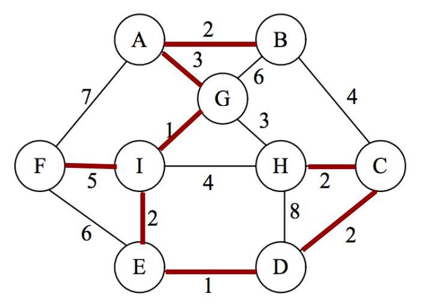
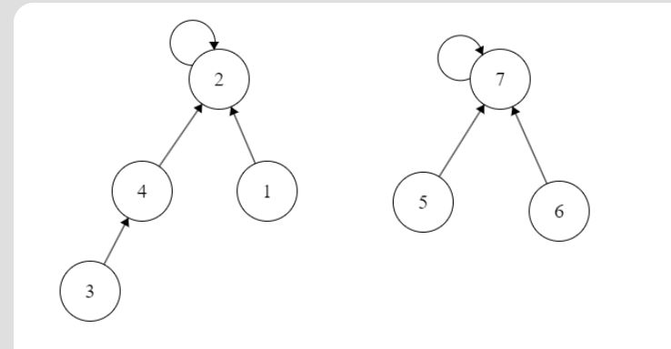
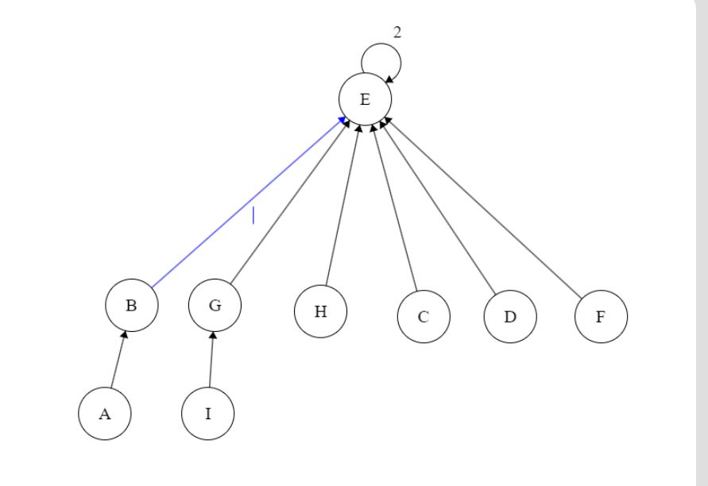
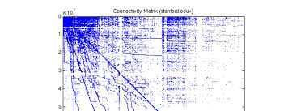

# Algorithms and Data Structure 🤖
![IA][IA]
# SUFFIX TREE

Estructura suficientemente todos los sufijos del texto en Trie

CPU: O(n)
RAM: O(n^2)

-- compact trie
CPU: O(m)
RAM: O(n)   

**Operaciones**
- building
- search

El ***insert*** y el ***remove*** no son operaciones que se usen en el suffix tree.


# Ejercicio 

Texto = "somososos"

```
s o m o s o s o s
0 1 2 3 4 5 6 7 8

o m o s o s o s

m o s o s o s

o s o s o s

s o s o s

o s o s

s o s

o s

s
```

# GRAFOS

Grafo cíclico y acíclico

Si el grafo contien al menos un ciclo se llama cíclico

G = (V, E)
**Máxima cantidad de aritas**
max E => V*(V-1)/2

**Vértices**
V = (a, b, c, d)

Grafo dirigido
-----------------
```
a => (a, b) (a, c) (a, d)     3 aristas
b => (b, a) (b, c) (b, d)     3 aristas 
c => (c, a) (c, b) (c, d)     3 aristas 
d => (d, a) (d, b) (d, c)     3 aristas 
                            -------------
                             12 aristas
maz E => V*(V-1) = 4*3 = 12
```

No-Dirigido
-----------------
```
a => (a, b) (a, c) (a, d)     3 aristas
b => (b, c) (b, d)            2 aristas
c => (c, d)                   1 aristas
d =>                          0 aristas
                            -------------
                              6 aristas
maz E => V*(V-1)/2 = 4*3/2 = 6
```

# DENSIDAD

2*aristas

# GRAFOS PONDERADOS

Un grafo ponderado, pesado o con costos es un grafo donde cada arista tiene asociado un valor o una etiqueta, para representar el costo, peso, longitud, etc.

# GRAFOS

```c++
// Implementacion ineficiente
# include <iostream>
#include <vector>

using namespace std;

// usando listas    

struct Edge{
    string startVertex;
    string endVertex;
    float weight;
}

class Graph{
    vector<string> vertex;
    vector<Edge*> edges;
}
```
# Representacion ingenua (listas de aristas)

Espacio: O(V) + 0(E)

Por qué esto no es eficiente?

# Matriz de Adyacencia

- Requiere una matriz de tamaño 

- Complejidad espacial : V^2





***Agregar un vértice es demasiado costoso***
***Representar en una matriz de adyacencia los siguientes grafos que se encuentran en el ppt***

***Con el grafo no dirigdo se desperdicia mucha memoria***

# LISTAS DE ADYACENCIA

Tiene una complejidad computacional de 

# KRUSKAL

Para verificar que no existen ciclos debemos, chekar que dos nodos no formen un ciclo



- fija para el examen (kruskal con disjoint set)

# DISJOINT SET

## ***Representación de varios conjuntos disjuntos***

```
A = {a, b, c, d}
B = {x, y, z}
C = {h, i, j}
```

``` c++
find(c)
// une al conjunto que pertence x en conjunt al que pertence d
union(x, d) = find(x) U find(d)
            = {x, y, z, a, b, c, d}
```
# Representacion de conjuntos disjuntos

## ***usando arrays***
```
find(x) ==> O(n)
union(x, y) ==> O(n) + O(n) + O(n)
```
----------------------------------------
## ***usando listas***
```
find(c) ==> O(n)
union(x, d) ==> O(n) + O(n) + O(1)
```
----------------------------------------
## ***usando arboles (avl) con todos los elementos***
```
find(c) ==> O(log n)
union(x, d) ==> O(log n) + O(log n) + O(n)
```
----------------------------------------
## usando avl por cada conjunto
find(c) ==> analizar
union(x, d) ==> analizar
----------------------------------------
## usando hash con todos los elementos
```
A = {a, b, c, d}
B = {x, y, z}
C = {h, i, j}
hastable = {(a:A), (b:A), (c: A), ...,(x:B), (y:B), ..., (h:C)}
find(c) ==> O(1)
union(x, y) ==> O(1) + O(1) + O(n)
```
----------------------------------------
```
find(c) ==> O(k), O(1)       k < log n "k es la altura del arbol"
union(x, y) ==> find + O(1)
```
# CONJUNTOS DISJUNTOS (OPERACIONES)



## Optimización 1

Union teniendo en cuenta el tamaño del arbol

```c++
function Union(x, y)
    xRoot := Find(x)
    yRoot := Find(y)
    if xRoot == yRoot
        return
    // Ya que no 
```
## Optimización 2

Path compression! Durante la ejecucion find(x) se hace que todos los nodos en el camino de x a la raiz apunten directamente a la raiz

# KRUSKAL

Se requieren 2 arrays para su implementacion 



-------
# Martes 13/06/23

# Grafo no Conexo 

Un grafo no conexo es cuando al menos un par de nodos no están conectados entre sí.

# Grafo Conexo

Un grafo conexo es cuando todos los nodos están conectados entre sí.

# BUSQUEDAS EN GRAFOS

## ***Búsqueda en profundidad (DFS)***

- Implementación de manera recursiva o iterativa

1. Elige cualquier vértice u, y agrégalo al stack marcandolo como visitado

````txt
Aplica el dfs y solamente me dan el vertice de salidas, entonces debo visitar a todos los nodos, hasta poder encintrar el vertice que estoy buscando.
````
# Algoritmo DFS


```cpp
function DFS(Graph G(V, E)){
    for each v in V
        v.visited = false
    for each v in V
        if v.visited == false
            DFS-Visit(v)
}
```

## ***Búsqueda en amplitud (BFS)***

- El arbol más ancho, pero poco profundo 

- Abro todas las puertas para tener una mejor visión de lo que hay en el grafo.

- Visitamos a la primera todos los nodos que encontramos conectados hacia el nodo visitado.

- Para explorar un grafo de esta manera vamos a necesitar una cola (queue).

* El camino corto tiene una cantidad de aplicaciones en la industria, aplicaciones de grandes escalas.

* Algortimo Dijkstra, es el más común, pero en la practica no es el más eficiente.

* Algoritmo asterisco, es el más eficiente.


# Dijkstra

* Requiere de un array de distancias, un array de padres y un array de visitados.

+ El array de distancias se inicializa con infinito, excepto el nodo de partida que se inicializa con 0.

![dijkstra][dijkstra]

# Best-First-Search

# A*

[dijkstra]: Dijkstra.jpg
[IA]:IA.jpg


# 27/06/23

# Matrices dispersas

Son estructuras ampliamente usadas con computacion cientifica,
sobretodo en optimizacion a gran escala, teoria de redes y grafos.

Dado que este tipo de matrices ocurren de manera muy mal natural, se han desarrollado distintas
maneras de representarlas.



```c++
Matrix de 4x5 con solo 6 valores

[
    0 1 2 0 0
    0 0 0 1 0 
    1 0 2 0 0
    0 0 0 0 1
]

-------------------

Matrix estatica (stack)
int M[4][5]
-- 4*5*4 = 80 bytes

M = new int*[5]

-------------------

Matrix Dynamic (heap) (Matriz dianmica con doble puntero)

int **M = new int*[4];
for(i = 0; i < 4; i++){
    M[i] = new int[5];
}

```
***RAM requerida***

- M : 8
- filas: 4*8 = 32
- celdas: 4*5*4 = 80
Total: 120 bytes

M1 100x2 = 8 + 100*8 + 100*2*4 = 2008
M2 2x100 = 8 + 2*8 + 2*100*4 = 816

* ¿M1 y M2 tiene el mismo tamaño?

    * M1 y M2 tienen la misma cantidad de elementos, pero M1 ocupa más espacio en memoria.

* ¿Existe alguna forma de representar ambas matrices tal que ambas pesen lo mismo?

    * 

-----------------------------------------
* vacios con nullptr

[

    n 1 2 n n 

    n n n 1 n 

    1 n 2 n n 

    n 3 n n n 
]

* La mejor manera de representar la ausencia de un valor es con un puntero nulo.

```c++
int ***M = new int***[4];
for (i = 0; i < 4; i++){
    M[i] = new int*[5];
    for (j = 0; j < 5; j++){
        M[i][j] = nullptr;
    }
}

set(i, j, X){
    if (M[i][j] != nullptr){
        M[i][j] = new int;
    }
    *M[i][j] = X;
}

```
- Espacio requerido
    - M : 8
    - filas: 4*8 = 32
    - celdas: 4*5*8 = 160
        - Subtotal: 144 bytes
    * Total = 200 + n * 4 
```
# Desperdicio de memoria con los punteros nulos
# Por ende es muy costoso


